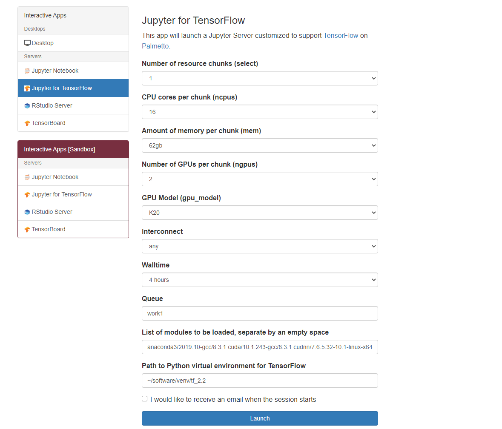

> ## 1. OpenOnDemand
> 
> - Connect to Clemson VPN
> - Visit `https://openod02.palmetto.clemson.edu`
> - Under `Interactive Apps`, select `Jupyter for TensorFlow`. 
> - Fill in the form with allocation request parameters similar to the command line
> you had earlier, as show in the screenshot below. Click **Launch** when done. 
>   - `Number of resource chunk (select)`: 1
>   - `CPU cores per chunk (ncpus)`: 16
>   - `Amount of memory per chunk (mem)`: 62
>   - `Number of GPUs per chunk (ngpus)`: 2
>   - `GPU Model (gpu_model)`: K20
>   - `Interconnect`: any
>   - `Walltime`: 4 hours
>   - `Queue`: work1
>   - `List of modules to be loaded, separate by an empty space`: `anaconda3/2019.10-gcc/8.3.1 cuda/10.1.243-gcc/8.3.1 cudnn/7.6.5.32-10.1-linux-x64-gcc/8.3.1`
>   - `Path to Python virtual environment for TensorFlow`: `~/software/venv/tf_2.5`
>
> 
>
{: .slide}

> ## 2. Notebooks
> 
> - Navigate to `tensorflow/training_demo`
> - Go through the three notebooks: `example-1.ipynb`, `example-2.ipynb`, and `example-3.ipynb`
>
{: .slide}



