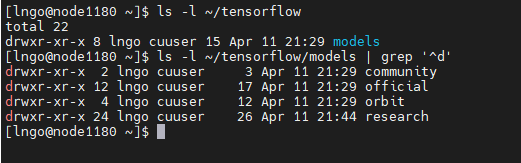
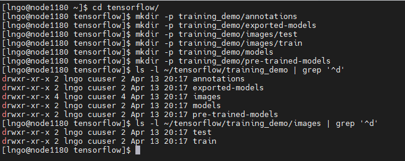

> ## 1. Initial directory setup
> 
> - From the setup step, you should have a directory called `tensorflow` under your 
> home directory. 
> - Inside `tensorflow`, there is the `models` directory. 
> - Run the following commands to test and confirm the directory structure as follows
>
> ~~~
> $ cd
> $ ls -l ~/tensorflow
> $ ls -l ~/tensorflow/models | grep '^d'
> ~~~
> {: .language-bash}
>
> 
>
{: .slide}

> ## 2. Training space creation
> 
> - We are going to create a directory called `workspace` under `tensorflow`. 
> - Inside `workspace`, create another directory called `training_demo` and the additional 
> subdirectories inside `training_demo` as follows:
>
> ~~~
> $ mkdir ~/tensorflow/workspace
> $ cd ~/tensorflow/workspace
> $ mkdir -p training_demo/annotations
> $ mkdir -p training_demo/exported-models
> $ mkdir -p training_demo/images/test
> $ mkdir -p training_demo/images/train
> $ mkdir -p training_demo/models
> $ mkdir -p training_demo/pre-trained-models
> ~~~
> {: .language-bash}
>
> 
>
> - Directory Description:
>   - `annotations`: This folder will be used to store all `*.csv` files and the respective 
>   TensorFlow `*.record` files, which contain the list of annotations for our dataset images.
>   - `exported-models`: This folder will be used to store exported versions of our trained model(s).
>   - `images`: This folder contains a copy of all the images in our dataset, as well as the 
>   respective `*.xml` files produced for each one, once labelImg is used to annotate objects.
>   - `images/train`: This folder contains a copy of all images, and the respective *.xml files, which 
>   will be used to train our model.
>   - `images/test`: This folder contains a copy of all images, and the respective *.xml files, 
>   which will be used to test our model.
>   - `models`: This folder will contain a sub-folder for each of training job. Each subfolder will 
>   contain the training pipeline configuration file *.config, as well as all files generated during 
>   the training and evaluation of our model.
>   - `pre-trained-models`: This folder will contain the downloaded pre-trained models, which shall 
>   be used as a starting checkpoint for our training jobs.
{: .slide}



